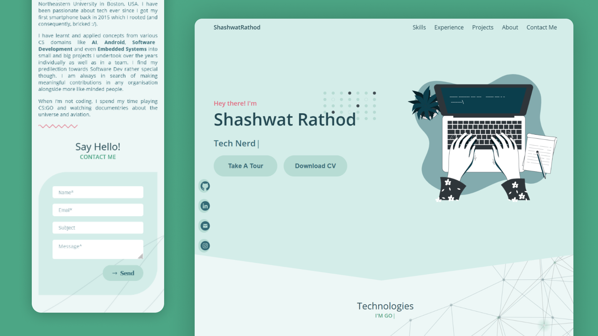

## ⚡ shashwatrathod.netlify.app

🔗 View: [Shashwat Rathod](https://shashwatrathod.netlify.app/) 👀

The website is designed using Figma✨ and developed using ReactJS⚛ and Sass💁‍♀️. It features a modern monochromatic design with intuitive UI and subtle animations.

## 🚀 About Me

📌 Boston, USA

🟢 Open for relevant Internships and Co-op opportunities throughout the USA.

I am a **software development** enthusiast who is currently pursuing **MS in Computer Science** from Northeastern University in Boston, USA. I have been passionate about tech ever since I got my first smartphone back in 2015 which I rooted (and consequently, bricked :/).

I have learnt and applied concepts from various CS domains like **AI**, **Android**, **Software Development** and even **Embedded Systems** into small and big projects I undertook over the years individually as well as in a team. I find my predilection towards Software Dev rather **special** though. I am always in search of making _meaningful contributions in any organisation_ alongside more like-minded people.

When I'm not coding, I spend my time playing CS:GO and watching documentries about the universe and aviation🤓.

## 🤝 Connect with me

  

## 🤖 Technologies Used

   
